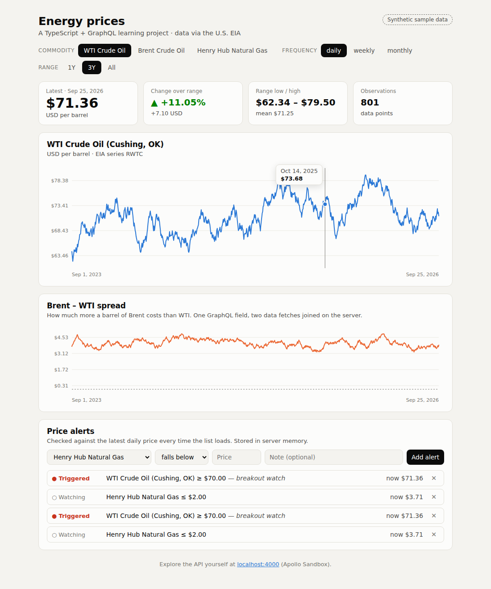

# Energy GraphQL

A typed **GraphQL API** and **React dashboard** for U.S. energy benchmark prices (WTI crude, Brent crude, Henry Hub natural gas), built on data from the U.S. Energy Information Administration.

I built this project to learn **TypeScript** and **GraphQL** end to end. One schema file drives the types for both the server and the browser, so a change to the API shows up as a compile error wherever it matters. The code is commented for learning, and [`LEARNING.md`](./LEARNING.md) walks through the concepts in the order you'll meet them.



## What's inside

| | |
|---|---|
| **API** | Apollo Server 5 · GraphQL 16 · TypeScript (strict) · Node 22 |
| **Web** | React 19 · Apollo Client 4 · Vite · a hand-written SVG chart |
| **Types** | GraphQL Code Generator: resolver types for the server, typed queries for the client |
| **Tests** | Vitest: 17 tests running real GraphQL operations against the server in memory |

**API features:** queries with arguments, default values and input objects · enums · per-field resolvers · computed fields · mutations · structured errors (`BAD_USER_INPUT`, `UPSTREAM_ERROR`) · a request cache that shares in-flight fetches · a swappable data source (live EIA or built-in sample data).

## Quick start

```bash
git clone https://github.com/davidaustindavid/energy-graphql.git
cd energy-graphql
npm install
npm run dev
```

- Dashboard: http://localhost:5173
- API + Apollo Sandbox (interactive query explorer): http://localhost:4000

With no setup, the API serves **synthetic sample data**: a seeded random walk, not real prices. The dashboard labels it as sample data. To use real EIA prices:

1. Get a free key at <https://www.eia.gov/opendata/register.php>
2. `cp server/.env.example server/.env` and paste the key into `EIA_API_KEY`
3. Restart `npm run dev`

## Try a query

Open http://localhost:4000 and paste:

```graphql
query {
  series(commodity: BRENT, frequency: MONTHLY, range: { from: "2025-01" }) {
    commodity { name unit }
    latest { date value }
    stats { min max changePercent }
    points(last: 3) { date value }
  }
  spread(a: BRENT, b: WTI) {
    points { date value }
  }
}
```

And a mutation:

```graphql
mutation {
  createAlert(input: { commodity: WTI, direction: ABOVE, threshold: 80, note: "breakout" }) {
    id
    triggered
    currentPrice
  }
}
```

## Project layout

```
server/
  src/graphql/schema.graphql   ← the API contract: start reading here
  src/graphql/resolvers.ts     ← the functions that fill in each field
  src/graphql/generated.ts     ← produced by codegen, do not edit
  src/data/                    ← EIA client, sample data, cache, alert store, math
  src/context.ts               ← what every resolver can reach
  test/                        ← API tests with a fake data source
web/
  src/graphql/operations.ts    ← every query and mutation the UI sends
  src/gql/                     ← produced by codegen, do not edit
  src/App.tsx                  ← filters and layout
  src/components/              ← chart, stat tiles, alerts panel
```

## Scripts

| Command | What it does |
|---|---|
| `npm run dev` | API on :4000 and web on :5173, both with hot reload |
| `npm test` | Run the API test suite |
| `npm run typecheck` | Run `tsc` on both packages |
| `npm run codegen` | Regenerate TypeScript types after changing the schema or a query |
| `npm run build` | Production build of both packages |

## Data

Prices come from the [EIA Open Data API v2](https://www.eia.gov/opendata/): spot series `RWTC` (WTI), `RBRTE` (Brent), and `RNGWHHD` (Henry Hub). EIA data is public domain.

## License

MIT
